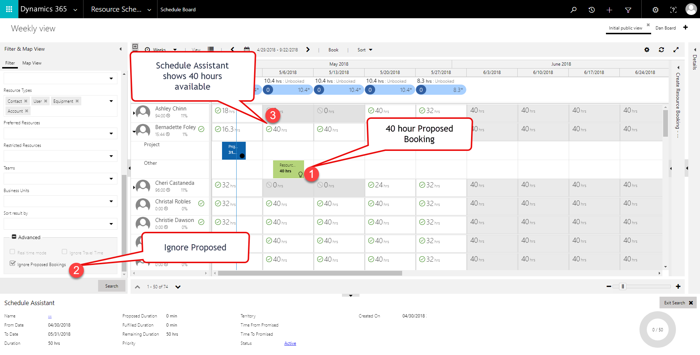

---

title: Ignore proposed bookings enhancements for Universal Resource Scheduling
description: When finding availability on schedule boards, your decision to ignore proposed bookings or consider proposed bookings will be reflected.
author: krbjoran
manager: shellyhaverkamp
ms.date: 06/01/2018
ms.topic: article
ms.prod: 
ms.service: business-applications
ms.technology: 
ms.author: krbjoran
audience: end user

---

# Ignore proposed bookings enhancements - multiday schedule assistant

[!include[banner](../../includes/banner.md)]

Previously, we introduced an option to control how to treat proposed bookings when searching for availability. You can consider proposed bookings as reserved time, or you can ignore these bookings and consider this time slot as available. Check out more details in this previous blog post in the "ignore or consider proposed bookings" section. In the last release, we introduced a way to change the default value.

Now, when finding availability on the multiday schedule boards, your decision to ignore proposed bookings or consider proposed bookings will be reflected in the total available hours displayed on the schedule board. Here is a screenshot showing that there are 40 hours of proposed bookings for Bernadette the week of 5/6, yet since we elect to "ignore proposed bookings" in our schedule assistant search, Bernadette still shows that she has 40 hours available that week:
 

Here you will see an identical screenshot, except the "ignore proposed bookings" option has been unchecked. So now, Bernadette shows zero hours of availability the week of 5/6 since she has 40 hours proposed already, and this user elected NOT to ignore the proposed bookings:

