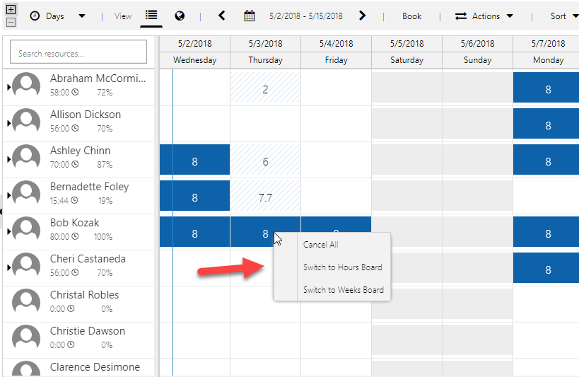

---

title: Label change for zoom functionality for Universal Resource Scheduling
description: Label changes for zooming on the schedule board are now clearer.
author: krbjoran
manager: shellyhaverkamp
ms.date: 06/01/2018
ms.topic: article
ms.prod: 
ms.service: business-applications
ms.technology: 
ms.author: krbjoran
audience: end user

---

# Label change for zoom functionality

[!include[banner](../../includes/banner.md)]

In a previous release, we introduced the ability to [seamlessly change your Schedule Board view](https://blogs.msdn.microsoft.com/crm/2017/10/16/july-2017-update-for-field-service-and-project-service-automation-universal-resource-scheduling-part-2/#general) between hourly, daily, weekly, and monthly, without losing context of the resource and date you are focused on. You can simply right-click to "zoom in" or "zoom out," which changes the Schedule Board view. 

To make the feature a bit more understandable to new users, these labels are changed, and dynamically describe the action more explicitly. For example, if you are on the daily board, upon right-clicking, the options will be "Switch to Hours Board" (previously "Zoom In") and "Switch to Weeks Board" (previously "Zoom Out").

