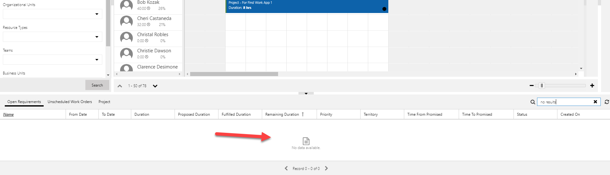

---

title: Display notification on booking requirements grid when no results found for Universal Resource Scheduling
description: We have added a notification to display "no results found" for booking requirements.
author: krbjoran
manager: shellyhaverkamp
ms.date: 06/01/2018
ms.topic: article
ms.prod: 
ms.service: business-applications
ms.technology: 
ms.author: krbjoran
audience: end user

---

# Display notification on booking requirements grid when no results found 

[!include[banner](../../includes/banner.md)]

Resource managers often search through the booking requirements grid at the bottom of the schedule board. We wanted to make the interaction more responsive in case there are no results that match the search criteria. Instead of whitespace, a message is shown to the user.

Here's what the "no results" state looked like before: 

And here's what the same state looks like after the update:

