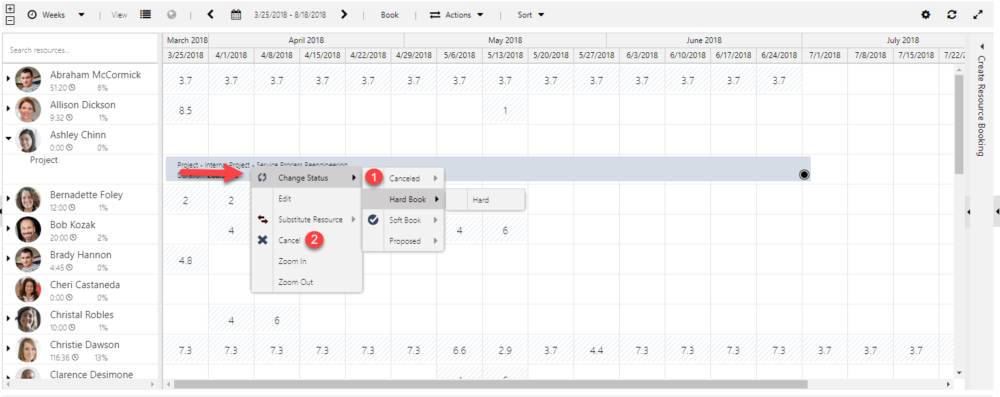

---

title: Removed redundant cancel option from multiday boards for Universal Resource Scheduling
description: We have removed redundant cancel options from multiday boards.
author: krbjoran
manager: shellyhaverkamp
ms.date: 06/01/2018
ms.topic: article
ms.prod: 
ms.service: business-applications
ms.technology: 
ms.author: krbjoran
audience: end user

---

# Removed redundant cancel option from multiday boards

[!include[banner](../../includes/banner.md)]

In the last release, we introduced the ability to [change booking statuses from the multiday schedule boards](https://blogs.msdn.microsoft.com/crm/2018/04/02/whats-new-in-universal-resource-scheduling-for-dynamics-365-april-2018-update/#changestatusmultiday). Before this enhancement, we had a special option to cancel bookings from the right-click menu. We have removed this redundant option:

