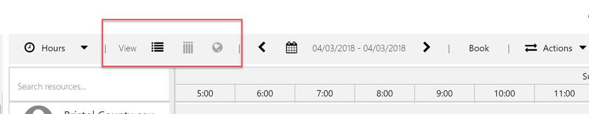
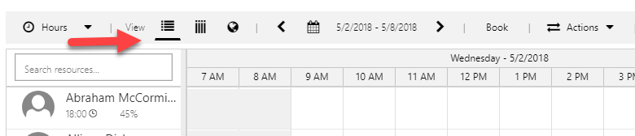

---

title: Schedule board view icons for Universal Resource Scheduling
description: Schedule board view icons are now underlined.
author: krbjoran
manager: shellyhaverkamp
ms.date: 06/01/2018
ms.topic: article
ms.prod: 
ms.service: business-applications
ms.technology: 
ms.author: krbjoran
audience: end user

---

# Schedule board view icons

[!include[banner](../../includes/banner.md)]

Previously, schedule board views that weren’t selected would appear gray, giving the impression that they were disabled. Now they are simply underlined instead.

Here were the icons before the update:

And here are the icons after the update:

