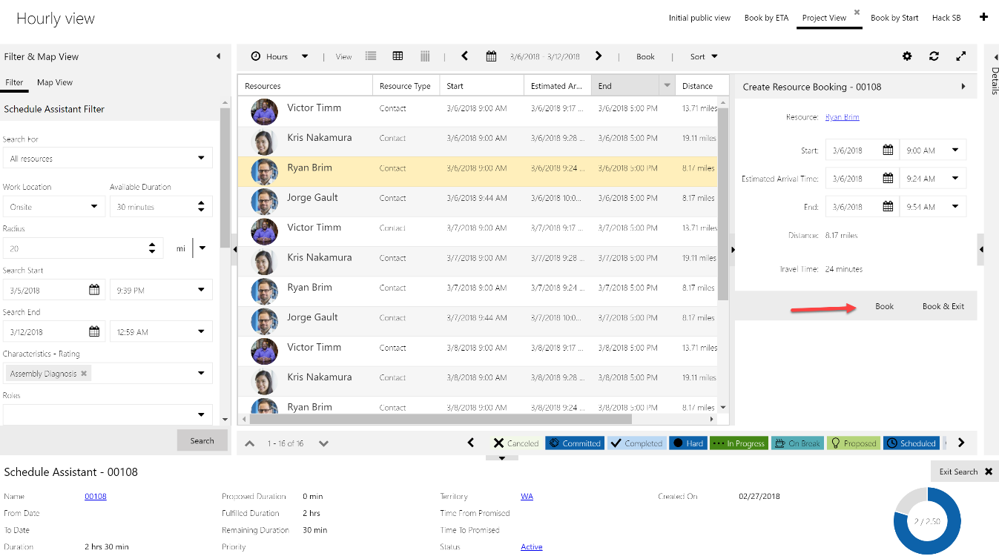
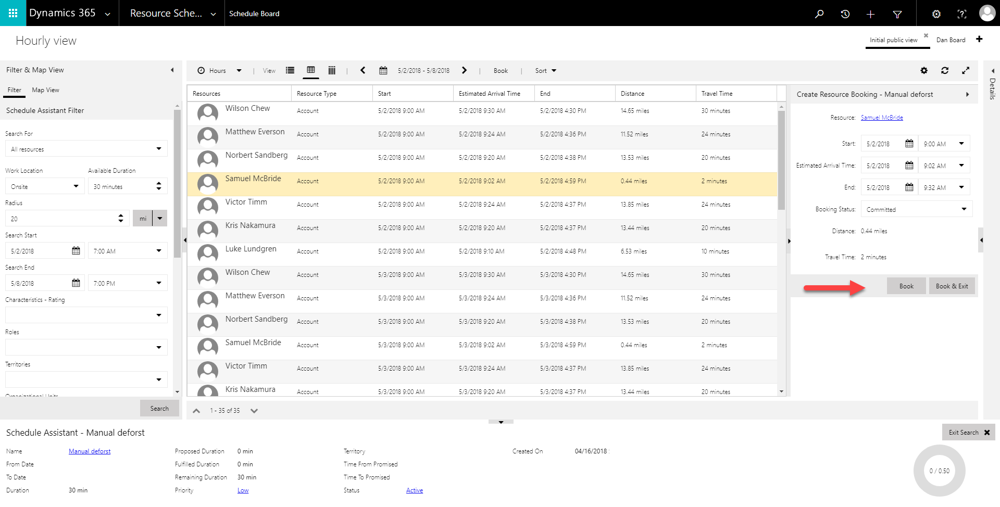

---

title: Styling change to buttons in panels for Universal Resource Scheduling
description: Primary actions such as "book" now designed with a background.
author: krbjoran
manager: shellyhaverkamp
ms.date: 06/01/2018
ms.topic: article
ms.prod: 
ms.service: business-applications
ms.technology: 
ms.author: krbjoran
audience: end user

---

# Styling change to buttons in panels

Primary actions such as "book" are designed with a background to attract the user’s attention.

